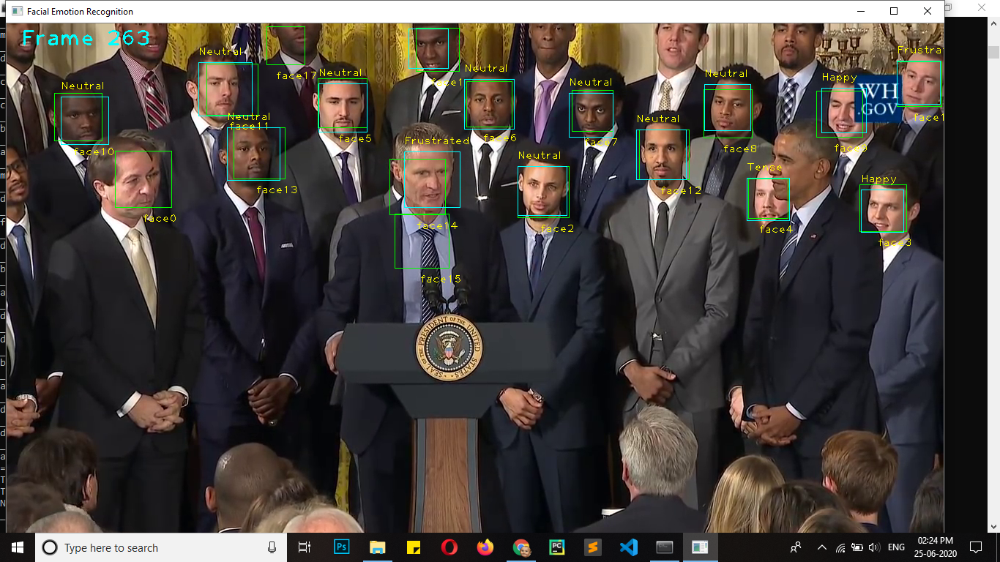
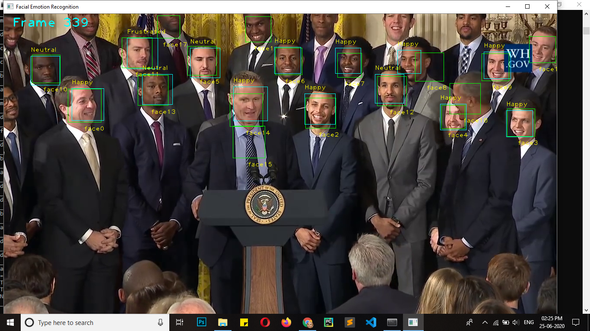
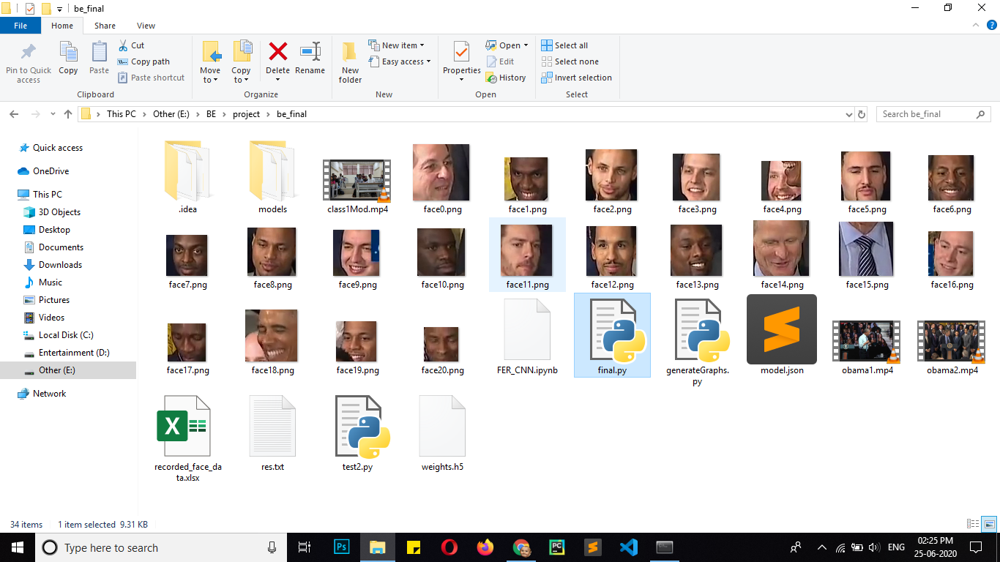
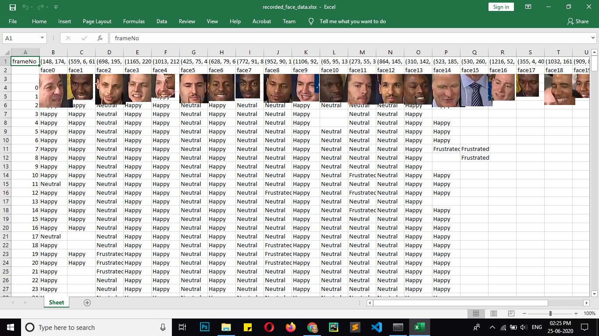

# REAL-TIME-VIDEO-FEEDBACK-USING-FACIAL-EXPRESSION-RECOGNITION.

## Problem Statement
The technique of Feedback Detection Using Facial Expression Recognition can outweigh
the existing Feedback Techniques. The Pen and Paper based Feedback Systems sometimes cannot be trustworthy and time consuming and also same is the case for online Feedback Systems.
For instance in Competitive Market of Content Producing Platforms, at present there is no
such known system where you can give feedback at particular point of the session or content.
The real-time and Circumstantial Feedback of audience can not only help in improvisation
of the content of the lecture but also bring progressiveness in more better techniques.

## Proposed Methodology
In the proposed system we are taking Winograd convolution approach to implement the Feedback Detection using Facial Expression Recognition. After the pre-processing and feature extraction, using Winograd Convolution we generate facial expression report, to keep track of the
emotion of a certain person we use Position based person tagging to generate a report over a
period.
<br/><br/>
***
## Instructions
***
**Files Structure:**

1. FER_CNN.ipynb - Tutorial to train the CNN
2. final.py - Uses the pre-trained model to give inferences. Produces recorded_face_data.xlsx which contains frame by frame facial expressions of people.
3. generateGraphs.py - generates statistics based on recorded_face_data.xlsx file.
3. model.json - Neural network architecture
4. weights.h5 - Trained model weights

## CNN Architecture

- TRAINING AND CLASSIFICATION
Supervised learning is an important technique for solving classification problems.
- CNN:
The task was to classify basic seven emotions that a person expresses such as: Neutral,
Happy, Surprise, Sad, Disgust, Anger, and Fear. To achieve this Winograd convolution
model was used.
    - Winograd Convolution:
An important point of optimization to discuss here is Winograd convolution .If we use
a convolution layer with filters of size 3x3; the number of parameters we need to train
our network is 9.Now consider using two layers with dimensions of 3x1 and 1x3. By
the property of matrix multiplication, we still get a matrix of 3x3 in theory but an added
advantage here would be that the number of parameters here have reduced to 3+3 = 6
instead of 9 in the former case. This comes at a cost of accuracy drop but compared
to performance gain, we would be going with the two convolution layers (3x1 and 1x3)
instead of one 3x3.
We use the below layers for our CNN model: The four initial phases, we try to have
features extracted and obtain a verbose feature map.

    - **Phase 1**  <br/> 
    Convolutional: Filters- 64, 
Size: 3x1,Stride- 1, Active padding, Input- 48x48x1 <br/> 
Convolutional: Filters- 64, Size: 1x3, Stride- 1, Active padding <br/> 
Batch Normalization <br/> 
Activation: ReLU <br/> 
MaxPool: Size- 2x2, Stride- None, Active padding <br/> 
Dropout: 0.25
    - **Phase 2** <br/>
Convolutional: Filters- 128, Size: 3x1, Stride- 1, Active padding <br/> 
Convolutional: Filters- 128, Size: 1x3, Stride- 1, Active padding <br/> 
Batch Normalization<br/> 
Activation: ReLU<br/> 
MaxPool: Size- 2x2, Stride- None, Active padding<br/> 
Dropout: 0.25<br/> 
    - **Phase 3** <br/>
Convolutional: Filters- 256, Size: 3x1, Stride- 1, Active padding<br/> 
Convolutional: Filters- 256, Size: 1x3, Stride- 1, Active padding<br/> 
Batch Normalization<br/> 
Activation: ReLU<br/> 
MaxPool: Size- 2x2, Stride- None, Active padding<br/> 
Dropout: 0.25<br/> 
    - **Phase 4** <br/>
Convolutional: Filters- 512, Size: 3x1, Stride- 1, Active padding<br/>
Convolutional: Filters- 512, Size: 1x3, Stride- 1, Active padding<br/> 
Batch Normalization<br/> 
Activation: ReLU<br/> 
MaxPool: Size- 2x2, Stride- None, Active padding<br/> 
Dropout: 0.25<br/> 
Flatten<br/> <br/> 
Using this 512 vector space feature map, fully connected layers(FCN or Dense layers) 
can be used<br/> 
    - **Phase 5** <br/>
FCN: Unit- 512
Batch Normalization
Activation: ReLU
Dropout: 0.25
13
    - **Phase 6** <br/>
FCN: Units- 256<br/> 
Batch Normalization<br/> 
Activation: ReLU<br/> 
Dropout: 0.25<br/> 
    - **Phase 7** <br/>
FCN: Units- 7<br/> 
Activation: Softmax<br/> <br/> 
Below, are the hyper-parameters defined for the CNN:<br/> 
Batch size: determines the number of input samples to be fed to the network together.<br/> 
Batch size = 32<br/> 
Epoch: an epoch is when all of the data is seen by the network once<br/> 
Num epochs = 30
<br/> <br/> 
- POSITION BASED PERSON TRACKING:
The steady footage was required as we used the position based person tagging to distinguish the people sitting in the room. The faces that were captured were stored in the
database on the basis of their position. But to add newly appeared faces (the faces that
was not previously captured), we developed an algorithm. This algorithm adds newly appeared faces based on the area of intersection with previously added faces. Now for every
face added in the dictionary, the facial expression associated with that face appearing in
that box was recorded in the dictionary. Finally, the statistics of that person was plotted
on the graph.

## More About POSITION BASED PERSON TRACKING
We used our algorithm to detect real time facial expressions of the attendees using the captured data from the steady camera. The steady footage was required as we used the position
based person tagging to distinguish the people sitting in the room. The faces that were captured
were stored in the database on the basis of their position. But to add newly appeared faces (the
faces that was not previously captured), we developed an algorithm. This algorithm adds newly
appeared faces based on the area of intersection with previously added faces. Now for every
face added in the dictionary, the facial expression associated with that face appearing in that box
was recorded in the dictionary. Finally, the statistics of that person was plotted on the graph.

**Position based person tracking flowchart**
 

<br/>

*** 

## Requirements

```
opencv-python==4.1.2.30
Keras==2.3.1
Keras-Applications==1.0.8
Keras-Preprocessing==1.1.0
tensorboard==2.1.0
tensorflow==2.1.0
tensorflow-estimator==2.1.0
tflearn==0.3.2
h5py==2.10.0
matplotlib==3.2.1
numpy==1.18.1
openpyxl==3.0.3
PyYAML==5.3
scipy==1.4.1
ffmpeg-python==0.2.0
```

## Guide to run 

**Clone Repository**
```
git clone https://github.com/slashcaret/FeedbackUsingFER.git
```
**Create new python 3.6.5 environment and switch to it**
```
//If you have anaconda installed; open anaconda prompt and enter following commands:

1. conda create -n feedbackFER python==3.6.5 --no-default-packages
2. conda activate feedbackFER

//change directory to the cloned git repo and install the requirements

3. pip install requirements.txt
```

**Execution and Feedback Generation**
- On existing video:

    For this application I have used a clip from townhall 360p video of then US President Obama which I found on youtube. <br/> 
    [Here is the link 11:02-11.51] (https://youtu.be/fEKx5FuMUR4)
    ```
    python final.py video_name.mp4 30
    ```
    Here, video_name.mp4 is the video file on which you want to generate the feedback and 30 is the no of fps. Both are mandatory arguments.

    **Note: The camera must be stable and fixed and position of the people must not be changed throughout the execution. This application is best suitable for classrooms, cinema halls, theatres, podiums and standup shows. Little bit of head movement is tolerable as vicinity of face was kept in mind while developing the solution**

- Realtime Feedback Generation using Webcam
    ```
    python final.py webcam 30
    ```

    When execution is complete [ You can stop the execution by pressing **Esc key**. ], <br/> "recorded_face_data.xlsx" file will be generated.
    <br/>
    In this file, Facial Expressions of the people present in each frame of the video is recorded.

- To generate graphs/statistics
    
    generateGraphs.py file uses recorded_face_data.xlsx file as input to calculate average classroom/hall sentiments as well as graph denoting average sentiments for each person during the seminar/class/lecture is also generated.
    ```
    python generateGraphs.py
    ```

***
## Results

1. Initially...


2. During Execution of final.py


3. During Execution of final.py Detecting Facial Expression of attendees


4.  After execution...  Faces of people are saved.


5. Preview of recorded_face_data.xlsx ...


6. generating graphs... by running generateGraphs.py .


